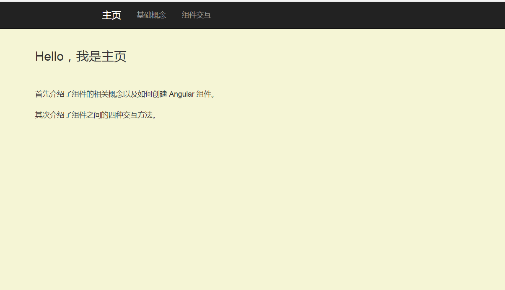

# learn-component

> 本工程为学习 Anguar4.0 component 部分的学习 demo。建议学习方式：以官网知识为主，本 demo 介绍了组件相关概念、如何创建 Angular 组件以及组件之间的四种交互方式。

## 快速开始

- 下载项目

```
$ git clone git@github.com:dkvirus/learn-angular4.0.git
```

- 切换到 learn-component 项目目录

learn-angular4.0 项目下每个子目录都是一个独立的工程，如 learn-component 目录就是学习 Angular4.0 component 部分的 demo 示例。

```
$ cd learn-angular4.0/learn-component
```

- 安装依赖包

```
$ npm install
```

如安装速度过慢，可设置淘宝镜像：`$ npm config set registry https://registry.npm.taobao.org`

- 启动项目

```
$ ng server
```

如端口号被占用，可设置其它端口： `$ ng server --port 4201`

## 页面展示


